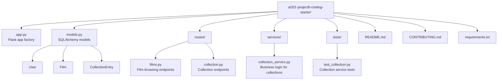
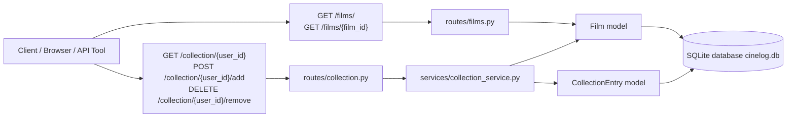
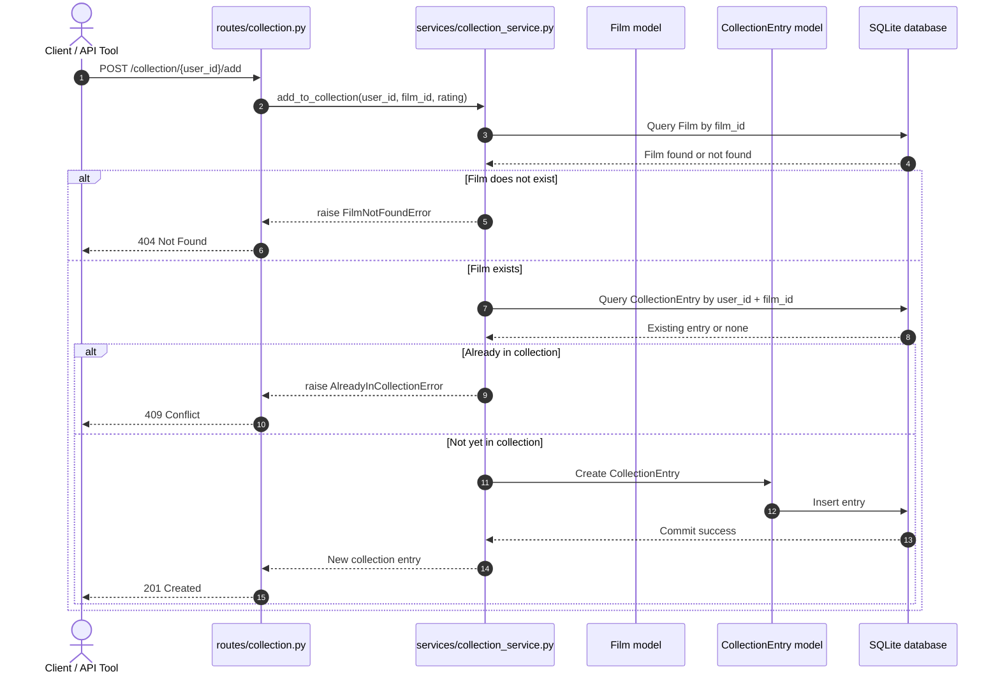
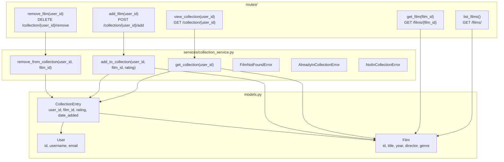
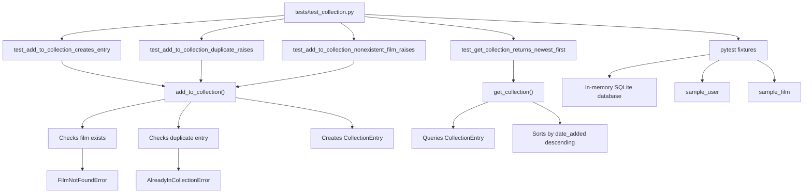
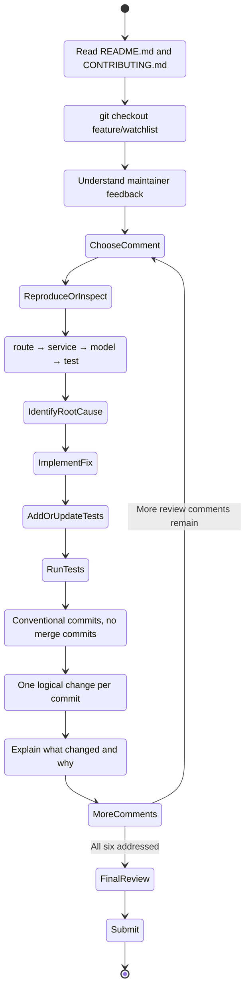
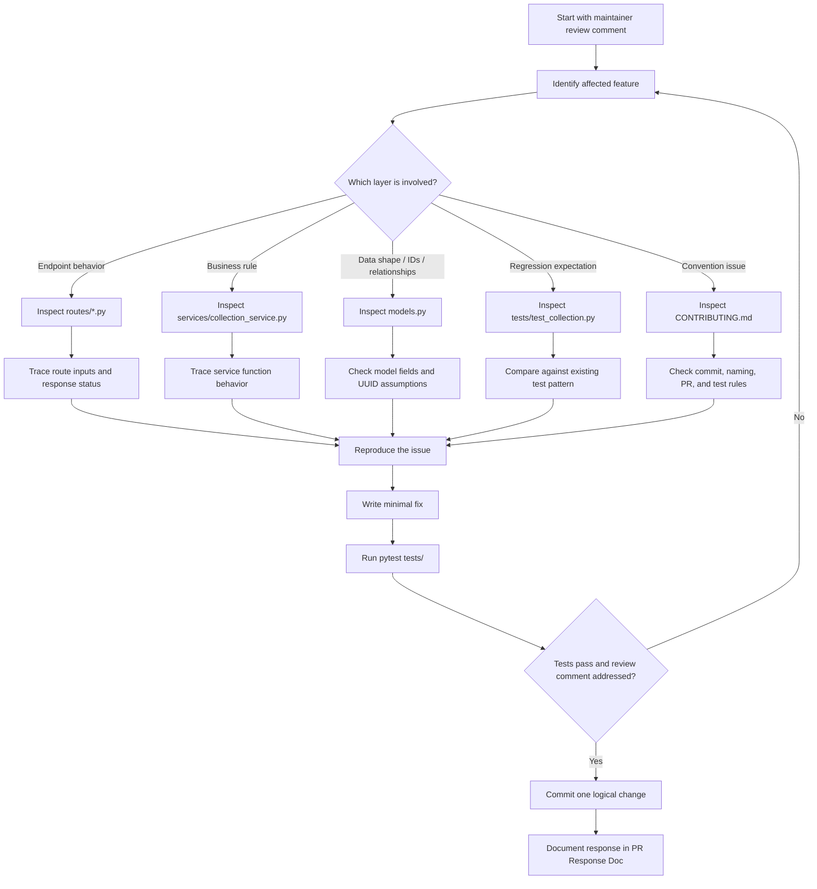

# CineLog

A community film tracking app. Users log films they've watched, rate them, and build collections.

This repository is the starting point for **Project 6: Simulated Code Review**.

---

## Setup

```bash
pip install -r requirements.txt
python app.py
```

The app starts on `http://localhost:5000` and uses a local SQLite database (`cinelog.db`).

---

## Project Structure

```
ai201-project6-cinelog-starter/
├── app.py                     # Flask app factory
├── models.py                  # SQLAlchemy models
├── services/
│   └── collection_service.py  # Business logic for collections
├── routes/
│   ├── films.py               # Film browsing endpoints
│   └── collection.py          # Collection endpoints
├── tests/
│   └── test_collection.py     # Tests for collection service
├── CONTRIBUTING.md            # Commit conventions and PR guidelines
└── requirements.txt
```

<details>
<summary><strong>Architecture diagram</strong> (optional study aid — not required for submission)</summary>



</details>

---

## API Overview

### Films

| Method | Endpoint | Description |
|--------|----------|-------------|
| GET | `/films/` | List all films (supports `?genre=` and `?year=` filters) |
| GET | `/films/<film_id>` | Get a single film by UUID |

### Collection

| Method | Endpoint | Description |
|--------|----------|-------------|
| GET | `/collection/<user_id>` | Get a user's collection (newest first) |
| POST | `/collection/<user_id>/add` | Add a film to the collection |
| DELETE | `/collection/<user_id>/remove` | Remove a film from the collection |

<details>
<summary><strong>Request flow diagram</strong> (optional study aid)</summary>



Film routes are read-only. Collection routes delegate to `collection_service.py`.

</details>

<details>
<summary><strong>Sequence diagram: add film to collection</strong> (optional study aid)</summary>



</details>

---

## Data Models

**Film** — A film in the catalog. IDs are UUIDs.

**User** — A registered user. IDs are UUIDs.

**CollectionEntry** — Links a user to a film they've watched. Stores rating and date added. A user can only have one entry per film.

<details>
<summary><strong>Route → service → model diagram</strong> (optional study aid)</summary>



Routes handle HTTP, services handle business logic, models represent database tables.

</details>

---

## Naming Conventions

Service functions follow a `verb_to_noun` pattern. See `CONTRIBUTING.md` for full details.

---

## Running Tests

```bash
pytest tests/
```

<details>
<summary><strong>Test coverage map</strong> (optional study aid)</summary>



</details>

---

## Your Task

You're working on the `feature/watchlist` branch, which adds a watchlist feature to CineLog. A maintainer (`@dev-lead`) has reviewed your PR and left six comments. Your job is to address all six.

Read `CONTRIBUTING.md` before touching any code. Then check out the `feature/watchlist` branch:

```bash
git checkout feature/watchlist
```

The open PR and the maintainer's review comments are filed on GitHub. Work through each comment and document your responses in your **PR Response Doc**.

<details>
<summary><strong>Homework workflow</strong> (optional study aid)</summary>



</details>

<details>
<summary><strong>Bug-investigation workflow</strong> (optional study aid)</summary>



</details>
