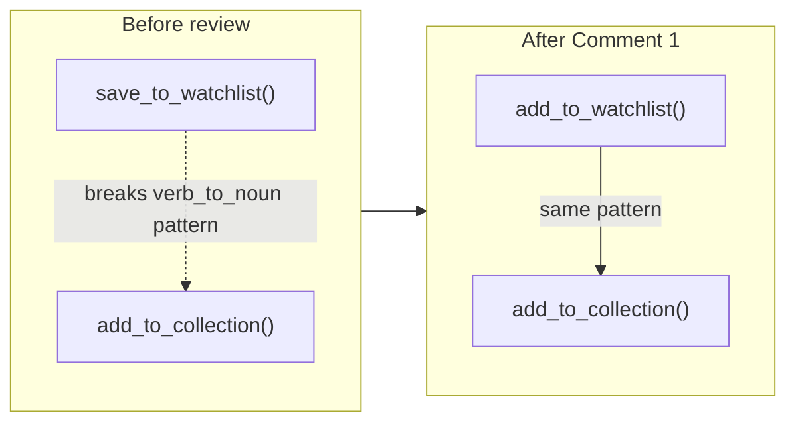
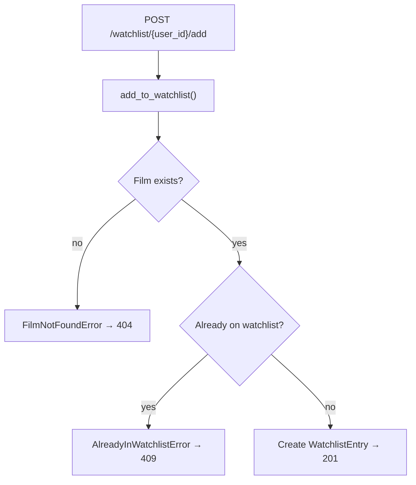
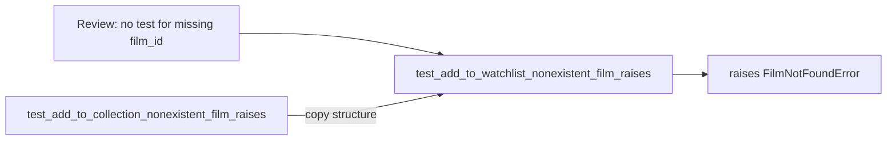
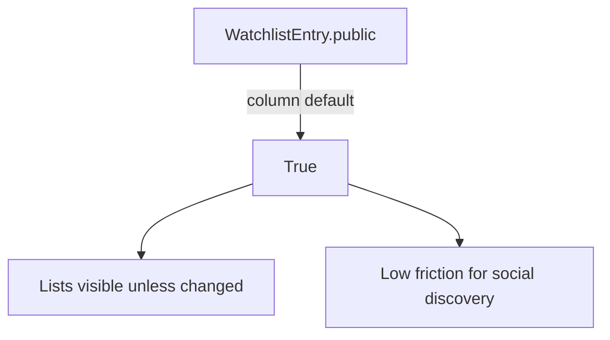
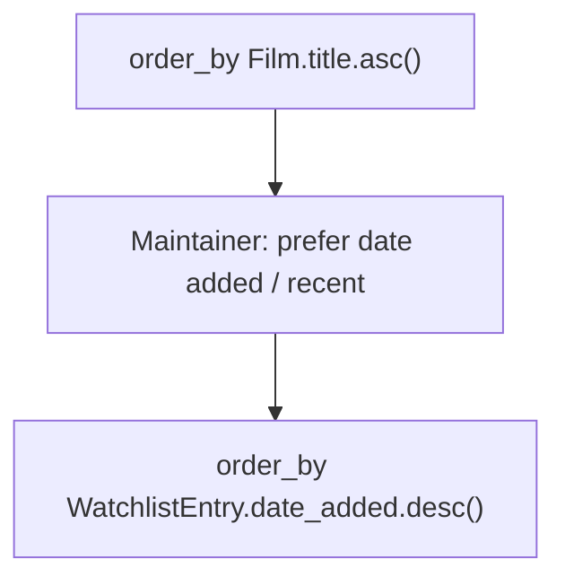
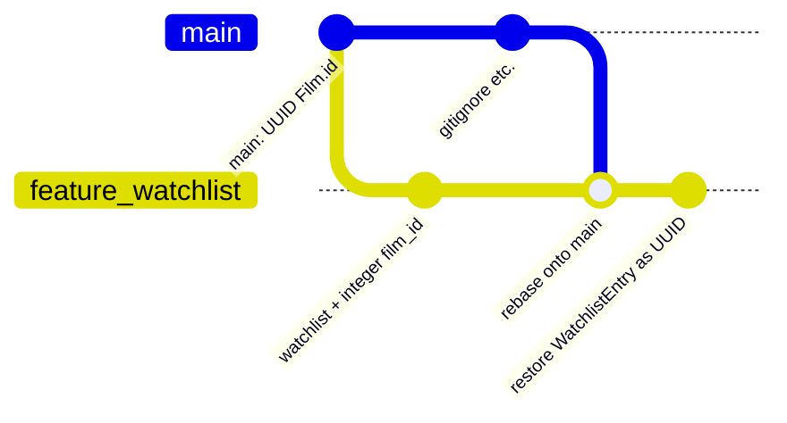
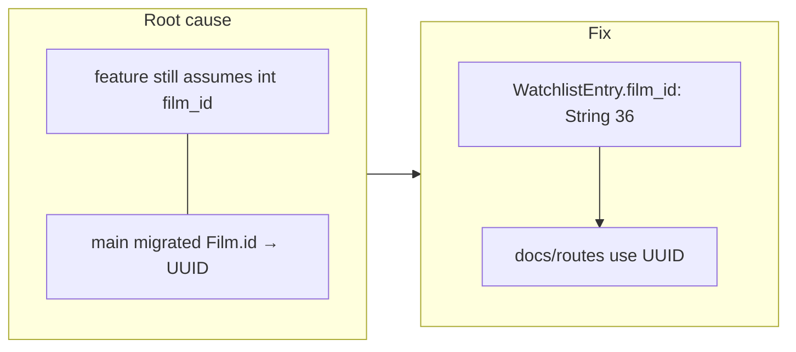

# PR Response Doc — CineLog Watchlist Feature

## AI Usage

Used AI tools for codebase orientation (mapping routes → services → models and
how watchlist comments relate to `add_to_collection` patterns), for generating
study Mermaid diagrams in this doc / README, and for stress-testing Comment 4
and Comment 5 drafts (devil’s-advocate feedback on specificity and tradeoffs).

For Comments 4 and 5 I wrote the substantive position myself after reading
`models.py`, `watchlist_service.py`, `collection_service.py`, and the film
catalog routes. AI critique pushed me to cut restating “the code already
defaults to True,” keep the community-discovery vs accidental-sharing tradeoff
explicit, and sharpen the watchlist-vs-catalog distinction for sort order.
Final wording in those sections is mine.

## How to learn from these commits

On `feature/watchlist`, inspect each logical fix:

```bash
git log --oneline upstream/main..HEAD
git show <commit-sha>          # full diff + message
git show --stat <commit-sha>   # which files changed
```

Suggested reading order (oldest → newest among the review fixes):

1. `fix: rename save_to_watchlist…` — naming only
2. `fix: add deduplication check…` — pattern copy from `add_to_collection`
3. `test: add test for nonexistent film_id…` — mirrors `test_collection.py`
4. `fix: order watchlist by date_added…` — Comment 5 code choice
5. `fix: restore WatchlistEntry with UUID…` — Comment 6 after rebase

---

## Comment 1 — Rename

**What I did:**
Renamed `save_to_watchlist()` to `add_to_watchlist()` in `services/watchlist_service.py` and updated the import/call site in `routes/watchlist/watchlist.py` so it matches the `verb_to_noun` convention used by `add_to_collection()`.

**How I verified:**
Project-wide search for `save_to_watchlist` returned no remaining references. `pytest tests/ -v` passes after the rename.

<details>
<summary>Root cause → fix (Mermaid)</summary>



</details>

## Comment 2 — Deduplication

**What I did:**
Mirrored `add_to_collection()`: after confirming the film exists, query `WatchlistEntry` by `(user_id, film_id)`. If an entry already exists, raise `AlreadyInWatchlistError`. The route maps that to HTTP 409 (and maps `FilmNotFoundError` to 404), matching collection error handling.

**How I verified:**
Compared control flow to `services/collection_service.py` / `routes/collection.py`. Ran `pytest tests/ -v`.

<details>
<summary>Root cause → fix (Mermaid)</summary>



**Root cause:** No existence check before insert → duplicate rows.
**Fix:** Same guards as collection (lookup + raise + HTTP mapping).

</details>

## Comment 3 — Missing test

**What I did:**
Added `tests/test_watchlist.py` with `test_add_to_watchlist_nonexistent_film_raises`, modeled on `test_add_to_collection_nonexistent_film_raises` (same fixtures style + `pytest.raises(FilmNotFoundError)`).

**How I verified:**
```bash
pytest tests/test_watchlist.py -v
pytest tests/ -v
```

<details>
<summary>Root cause → fix (Mermaid)</summary>



</details>

## Comment 4 — Default visibility

**My position:**
I chose to make watchlist entries public by default.

**Reasoning:**
Watchlists can support social discovery by letting friends and other CineLog
community members see which films a user is interested in watching. This can
encourage recommendations and conversations around shared interests.

**Tradeoff acknowledged:**
This choice prioritizes community discovery over protecting users from
accidentally sharing their “want to watch” activity. Because the current
endpoint does not allow users to choose visibility when adding a film,
configurable privacy should be added as a focused follow-up rather than
expanding the scope of this PR.

<details>
<summary>What the code does today (context only)</summary>



`public = db.Column(db.Boolean, default=True)` in `models.py`. Comment 4 is a **written** decision — no code change required unless you do the stretch feature.

</details>

## Comment 5 — Sort order

**My position:**
I chose to sort watchlist entries by `date_added` descending, with the most
recently added film first. Implemented in `get_watchlist()`.

**Reasoning:**
A watchlist functions as a personal planning queue, so users are likely to want
quick access to films they saved recently. This also keeps personal-list
behavior consistent with the collection, which uses newest-first ordering.

**Engagement with reviewer's point:**
I agree that users generally want what they added recently. I rejected
alphabetical ordering because it is better suited to browsing the film catalog
than managing a personal queue. Alphabetical order makes titles predictable to
locate, but it does not preserve the context of what the user recently decided
to watch.

**Tradeoff acknowledged:**
Newest-first makes recent additions easier to recover, but users looking for a
specific older entry may need to scan the list. Search, filtering, or selectable
sort options could address that in a future enhancement.

<details>
<summary>Root cause → fix (Mermaid)</summary>



</details>

## Comment 6 — Rebase

**What conflicted:**
Rebasing `feature/watchlist` onto `upstream/main` brought in the UUID film-ID migration. Main’s `models.py` has UUID `Film.id` and no `WatchlistEntry`. After rebase, the watchlist service still imported `WatchlistEntry` while `models.py` no longer defined it (and old docs/routes still said integer `film_id`).

**How I resolved it:**
1. `git fetch upstream && git rebase upstream/main`
2. Restored `WatchlistEntry` on top of main’s UUID models with `film_id` as `String(36)` FK to `film.id`
3. Updated service/route docs to say UUID instead of int
4. Added `watchlist_entries` relationships on `User` / `Film`

**How I verified no conflict remains:**
```bash
git log --oneline --merges upstream/main..HEAD   # should print nothing
pytest tests/ -v
# Film.id and WatchlistEntry.film_id are both UUID strings in models.py
```

<details>
<summary>Root cause → fix (Mermaid)</summary>





</details>

## PR Description

<!-- Also paste this into the GitHub PR body on YOUR fork (feature/watchlist → main). -->

### What this feature does
Adds a watchlist so users can save films they want to watch later (separate from
the collection of already-watched films). Includes a `WatchlistEntry` model,
`add_to_watchlist` / `get_watchlist` service helpers, and REST endpoints under
`/watchlist`. Review feedback is addressed: naming, deduplication, a missing
film_id test, design notes for visibility and sort order, and a rebase onto
main’s UUID film IDs.

### Design decisions
- **Default visibility (`public=True`):** Watchlist entries are public by
  default so friends and community members can discover shared interests;
  tradeoff is accidental sharing of “want to watch” activity. Configurable
  privacy is deferred to a follow-up (add endpoint has no visibility param).
- **Sort order:** Watchlists use `date_added` descending (newest first),
  matching collection behavior for personal queues. Alphabetical order was
  rejected as better for catalog browsing than for recovering recent saves.

### How to manually test
```bash
# From repo root, with venv active:
pip install -r requirements.txt
pytest tests/ -v

# Optional API smoke after inserting a User + Film (UUIDs) into the DB:
#   GET  /watchlist/<user_id>
#   POST /watchlist/<user_id>/add  -H 'Content-Type: application/json' \
#        -d '{"film_id":"<film-uuid>"}'
# Duplicate POST should return 409; unknown film_id should return 404.
```

## Git Log Screenshot

After `git log --oneline` on `feature/watchlist` (≥4 conventional commits, no merge commits):

**GitHub web editor:** open this file → click the line below → paste or drag-and-drop the PNG/JPG. GitHub uploads it and rewrites the `SRC` for you.


<!-- If the image doesn’t auto-replace PLACEHOLDER_…, after upload you should see something like:

-->

## Remaining checklist (before Course Portal submit)

1. Interactive rebase to clean remaining non-conventional history (especially
   `added watchlist model and endpoint…`) — see Milestone 4 in `projects.txt`.
2. Drop the `git log --oneline` screenshot into the placeholder above (GitHub web UI works well).
3. `git push origin feature/watchlist --force-with-lease`
4. Open PR on **your fork**: `feature/watchlist` → `main`; paste PR Description.
5. Submit branch URL like
   `https://github.com/<you>/ai201-project6-cinelog-starter/tree/feature/watchlist`
